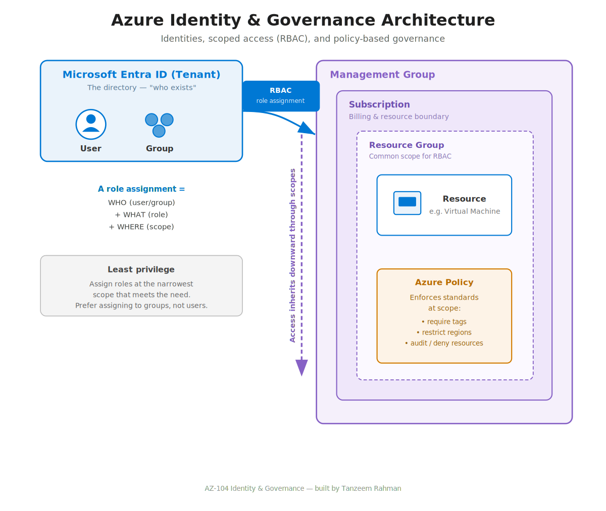

# Architecture Overview

This setup follows Azure's resource hierarchy and identity model.

## Identity & access hierarchy

Azure organizes access top-down through nested scopes. Permissions assigned at a
higher scope inherit downward:

- **Microsoft Entra ID (directory/tenant)** — holds all identities: users and groups.
- **Management group** — groups subscriptions; policies and roles set here flow down.
- **Subscription** — the billing and resource boundary.
- **Resource group** — a container for related resources; a common scope for RBAC.
- **Resource** — the individual item (VM, storage account, etc.).

## How access is granted

Access is granted through **role assignments**, each made up of three parts:
- **Who** — a user or group (from Entra ID)
- **What** — a role (a bundle of permissions, e.g. Reader, Contributor, Virtual Machine Contributor)
- **Where** — the scope it applies to (management group → subscription → resource group → resource)

Roles assigned at a higher scope are inherited by everything beneath them, so access
is granted at the narrowest scope that still meets the need (least privilege).

## Governance

Azure Policy enforces standards across these scopes — for example requiring tags,
restricting regions, or auditing non-compliant resources. Individual policies can be
grouped into initiatives and assigned at a scope, applying to everything within it.

## Diagram

